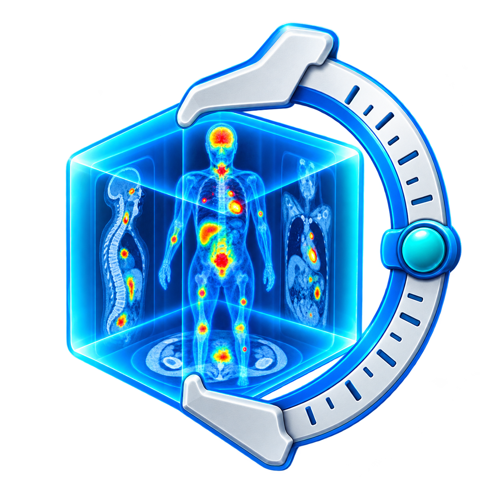
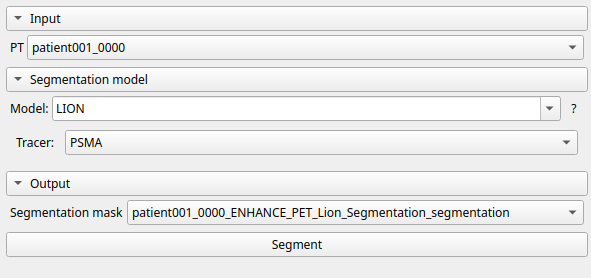
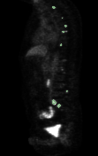
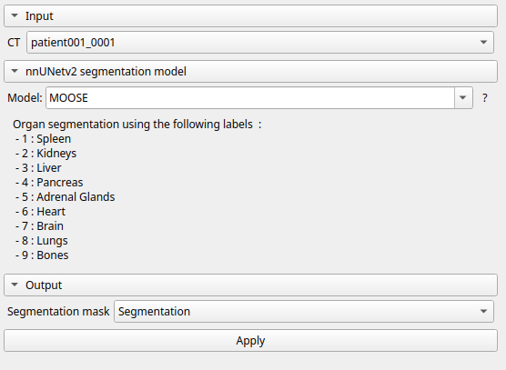
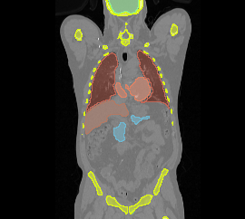
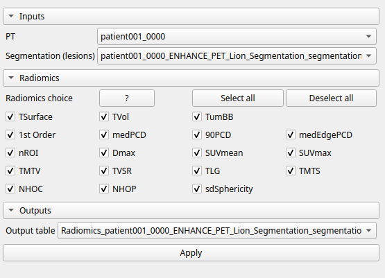
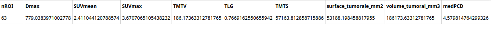
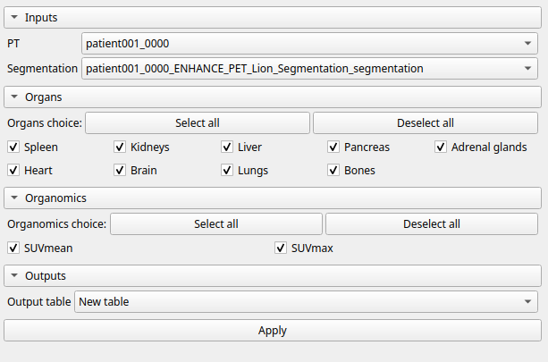
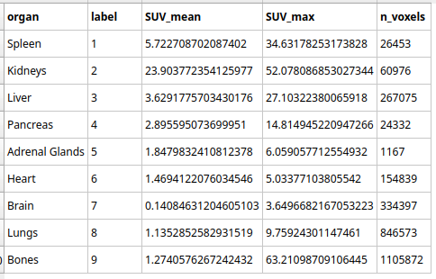

# Oncometer

<p align="center">
  
</p>


Oncometer is a 3D Slicer extension for PET/CT oncology workflows. It provides lesion and organ segmentation, radiomics extraction, and organ-level quantification.

## Modules

### SegmentLesionsModule

Segments lesions from PET/CT data using the ENHANCE-PET LION model or a custom nnUNet model of your choice for lesions. The module supports the built-in LION workflow and custom nnU-Net configurations.

### SegmentOrgansModule

Segments organs from CT data using the ENHANCE-PET MOOSE model or a custom nnUNet model of your choice supporting the following labels. The output contains the supported anatomical labels, including liver, kidneys, spleen, heart, lungs, and bones.

### RadiomicsModule

Computes radiomic measurements from a PET volume and a lesion segmentation. Results are written to an MRML table. Available measurements include lesion count, SUV statistics, metabolic volume and surface, distances, shape metrics, and optional PyRadiomics first-order features.

### OrganomicsModule

Computes organ-level measurements from a PET volume and an organ segmentation, and writes the results to an MRML table.


## Installation

Install **OncometerExtension** from the 3D Slicer Extension Manager. The manager resolves the declared `SlicerRadiomics` dependency automatically when that extension is available for the selected Slicer version and platform. Restart Slicer after installation if requested.

The segmentation packages are installed on first use in Slicer's Python environment:

* `lionz` for lesion segmentation.
* `moosez` for organ segmentation.

The `Dmax` and `TMTS` metrics install `scipy` and `scikit-image` on first use. The `FirstOrder` metric requires `SlicerRadiomics`, which provides PyRadiomics. PyRadiomics is not installed directly with pip because its published packages are not compatible with Slicer's Python 3.12 environment.

## nnU-Net Models

The `SegmentLesionsModule` and `SegmentOrgansModule` use an ENHANCE PET model by default in the code:

* `ENHANCE PET Lion Segmentation` for lesions, with a binary output using label `1`.
* `ENHANCE-PET Moose Segmentation` for organs, with labels `0-9`. The labels are as follows:

  * 1: Spleen
  * 2: Kidneys
  * 3: Liver
  * 4: Pancreas
  * 5: Adrenal Glands
  * 6: Heart
  * 7: Brain
  * 8: Lungs
  * 9: Bones

Alternatively, nnU-Net models can be added from the **Custom nnU-Net** configuration page.


### Expected Model Weights Directory Structure

The results directory for a custom nnUNet model for segmentation should contain the usual nnU-Net artifacts, with a structure such as:

```text
nnUNet_results/

    DatasetXXX_DatasetName/

        nnUNetTrainer__nnUNetPlans__3d_fullres/

            fold_0/

                checkpoint_final.pth

            fold_1/

                checkpoint_final.pth

            fold_2/

                checkpoint_final.pth

            fold_3/

                checkpoint_final.pth

            fold_4/

                checkpoint_final.pth
```

If your environment does not automatically expose `nnUNet_results`, specify the expected path in the module interface or in the configuration associated with the model.

## Workflow

The global workflow is:

1. Load the PET and CT volumes into the Slicer scene.
2. Segment the lesions with `SegmentLesionsModule`.
3. Segment the organs with `SegmentOrgansModule`.
4. Extract lesion radiomics with `RadiomicsModule`.
5. Extract organ-level measurements with `OrganomicsModule`.

The segmentation modules install `lionz` and `moosez` automatically when they are used for the first time. The `Dmax` and `TMTS` radiomics metrics install `scipy` and `scikit-image` on first use. The `FirstOrder` radiomics metric requires the `SlicerRadiomics` extension, which is normally provided by the Slicer Extension Manager. The workflow will prompt you to restart Slicer if any of these packages are installed.

### 1. Segment Lesions

Open **SegmentLesionsModule** from the `Quantification.Oncometer` category.

1. Select the PET volume as the input volume.
2. Select the built-in ENHANCE PET Lion model, or open the custom nnU-Net configuration.
3. Check the model settings and results directory when using a custom model.
4. Click **Apply**.
5. Review the output segmentation in the Slicer viewers.

The built-in LION workflow produces a binary lesion segmentation. The resulting segmentation node is used as the input for the Radiomics module.

#### Lesion segmentation interface


<p align="center">
  
</p>

#### Lesion segmentation result

<p align="center">
  
</p>

### 2. Segment Organs

Open **SegmentOrgansModule**.

1. Select the CT volume as the input volume.
2. Select the ENHANCE PET MOOSE models, or configure a custom nnU-Net model.
3. Check the model settings and results directory when using a custom model.
4. Click **Apply**.
5. Review the labeled organ segmentation in the Slicer viewers.

The organ segmentation supports the following labels:

| Label | Organ |
| ---: | --- |
| 1 | Spleen |
| 2 | Kidneys |
| 3 | Liver |
| 4 | Pancreas |
| 5 | Adrenal glands |
| 6 | Heart |
| 7 | Brain |
| 8 | Lungs |
| 9 | Bones |

#### Organ segmentation interface

<p align="center">
  
</p>

#### Organ segmentation result

<p align="center">
  
</p>
### 3. Extract Lesion Radiomics

Open **RadiomicsModule** after the lesion segmentation is available.

1. Select the PET volume.
2. Select the lesion segmentation or labelmap.
3. Select an existing MRML table, or choose **New table**.
4. Select the metrics to compute.
5. Click **Apply**.

The module writes one global result row to an MRML table. Available measurements include lesion count, SUV statistics, metabolic tumor volume, tumor surface, distances, shape measurements, and optional PyRadiomics first-order features.

The `FirstOrder` metric requires `SlicerRadiomics`. The `Dmax` and `TMTS` metrics install their Python dependencies automatically on first use. Restart Slicer if requested after a package installation.

#### Radiomics interface

<p align="center">
  
</p>

#### Radiomics result

<p align="center">
  
</p>

### 4. Extract Organomics

Open **OrganomicsModule** after the organ segmentation is available.

1. Select the organ segmentation.
2. Select the PET volume.
3. Select an existing MRML table, or create a new output table.
4. Select the organ measurements to compute.
5. Click **Apply**.

The module computes organ-level measurements from the PET volume and the labeled organ segmentation, then writes the results to an MRML table.

#### Organomics interface

<p align="center">
  
</p>

#### Organomics result

<p align="center">
  
</p>